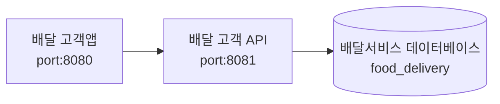

# 프로젝트
- 배달 서비스 프로젝트를 위한 **고객 앱**
- 서버 Port: 8080

# 준비사항
- (필수) 데이터베이스 설치
  - **food_delivery** 생성
  - 관련 테이블 생성
- (필수) **delivery-api** 프로젝트 실행
- (필수) 지도를 위한 Google Map Key

# 시스템 구성과 흐름

# 초기 접속 URL
- http://localhost:8080/

# 초기 계정
- ID: test@test.com
- PW: 1111

# 실행 화면 - 크롬 브라우저
- 개발자 도구 >> 모바일

